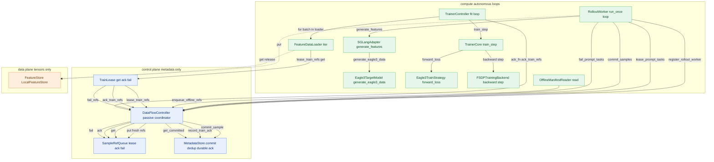

# SpecForge DataFlow Runtime — Architecture (M1–M4)

The runtime moves SpecForge from a trainer-centered god-script to explicit
contracts across **two planes**. This is the cross-plane map; each plane also has
its own design note (see "Per-plane internals" below).

## Plane responsibilities

- **Contracts** — the stdlib-only data records every plane exchanges (`PromptTask`, `SampleRef`, `FeatureSpec`, `FeatureHandle`, `TrainBatch`) plus `assert_no_tensors`, which enforces the no-tensor boundary. Control-plane records carry metadata only; `TrainBatch` is the sole tensor carrier and lives only on the trainer side.
- **Control plane** — `DataFlowController` (a passive coordinator with no run loop), `MetadataStore` (commit dedup + the single durable ack transaction), `SampleRefQueue` (lease/ack/fail transport), and `TrainLease`. Moves metadata only; every record-accepting entrypoint runs `assert_no_tensors`.
- **Data plane** — `FeatureStore`/`LocalFeatureStore` is the only holder of tensors, addressed by metadata-only `SampleRef`. `FeatureDataLoader` is the bridge that materializes refs + store into collated `TrainBatch`es; `OfflineManifestReader` turns precomputed `.ckpt` files into in-place `file://` refs.
- **Inference (compute)** — `RolloutWorker` + `SGLangAdapter` extract features from the target engine and commit only `SampleRef` metadata; `SGLangAdapter._project_target` is the sole target to draft projection site and `verify_capture` is the loud pre-`put` validator.
- **Training (compute)** — `TrainerController` -> `TrainerCore` -> `DraftTrainStrategy` + `FSDPTrainingBackend` turn `TrainBatch`es into optimizer steps and checkpoints; the strategy owns projection/loss, the core is branch-free.

## End-to-end flow

**Online:** `RolloutWorker.run_once` leases prompts (`lease_prompt_tasks`), calls `generate_features` (which drives `generate_eagle3_data`), runs `verify_capture`, then `FeatureStore.put` writes tensors **directly to the data plane**. Only the resulting `SampleRef` metadata goes to the controller via `commit_samples`, which dedups through `MetadataStore.commit_sample` and enqueues fresh refs onto `SampleRefQueue`.

**Offline:** `OfflineManifestReader.read()` emits in-place `file://` `SampleRef`s (no tensor copy) and the launcher calls `enqueue_offline_refs`, which dedups and enqueues onto the **same** `SampleRefQueue`.

**Convergence + training:** Both paths converge at `SampleRef` on one queue, so the trainer has no online/offline branch. `TrainerController.fit` drives `for batch in loader`; the `FeatureDataLoader` leases refs through a `TrainLease` (`lease_train_refs` via the controller) and fetches the actual tensors **directly** from the `FeatureStore` (`get`/`release` with clone-on-fetch). `TrainerCore.train_step` runs forward/loss/backward and steps the optimizer at the grad-accum boundary; at that boundary `ack_fn` calls `ack_train_refs`, which records the durable ack transaction (`record_train_ack`) **before** releasing the queue lease.

## System map

Solid edges = control / metadata flow. Dashed edges = tensor flow (data plane).
The `DataFlowController` is **passive**: callers point *into* it, and its only
outbound edges go to its own `SampleRefQueue` and `MetadataStore`. Tensors never
cross the controller.

## Endpoint reference

| Caller | Endpoint called | Plane | Purpose |
|---|---|---|---|
| RolloutWorker | register_rollout_worker | control | Register worker, obtain authoritative worker_id (no-tensor guard on info) |
| RolloutWorker | lease_prompt_tasks | control | Pop up to max_tasks pending PromptTasks, mark leased to worker_id |
| RolloutWorker | generate_features | compute | Ask the FeatureSource (SGLangAdapter) for one feature dict per task |
| SGLangAdapter | generate_eagle3_data | compute | Run the target engine's batched forward to extract hidden_states/target |
| RolloutWorker | put | data | Persist verified feature tensors directly to FeatureStore, get back a SampleRef |
| RolloutWorker | abort | data | Clean up a partial/failed write so no corrupt sample is left |
| RolloutWorker | commit_samples | control | Commit metadata-only SampleRefs; dedup + enqueue fresh refs |
| RolloutWorker | fail_prompt_tasks | control | Release failed prompt leases (retryable or terminal) so none are stranded |
| OfflineManifestReader | enqueue_offline_refs | control | Offline ingest: dedup + enqueue file:// SampleRefs onto the same queue |
| DataFlowController | commit_sample | control | Dedup committed samples (True=new, False=duplicate) |
| DataFlowController | record_train_ack | control | Persist the single durable ack transaction before releasing leases |
| DataFlowController | get_committed | control | Resolve acked/failed sample_ids back to full SampleRef objects |
| DataFlowController | put | control | Enqueue freshly committed refs onto the shared SampleRefQueue |
| DataFlowController | get | control | Serve train-side leases from the SampleRefQueue |
| DataFlowController | ack | control | Release queue leases after the durable ack transaction is recorded |
| DataFlowController | fail | control | Route train-side ref failures through the queue (retryable flag) |
| TrainLease | lease_train_refs | control | Loader's get(): lease train refs via the controller, not a raw queue |
| TrainLease | ack_train_refs | control | ack(): record durable transaction + release leases via the controller |
| TrainLease | fail_refs | control | fail(): route ref failures through the controller |
| FeatureDataLoader | lease_train_refs (via TrainLease.get) | control | Lease a batch of refs from the stream |
| FeatureDataLoader | get | data | Fetch a sample's tensors + lease FeatureHandle directly from the store |
| FeatureDataLoader | release | data | Release the lease immediately after clone-on-fetch so prefetch can't race |
| TrainerController | for batch in loader (__iter__) | compute | Drive the loader to yield collated TrainBatch objects |
| TrainerController | train_step | compute | Run each micro-batch; read optimizer_stepped boundary signal |
| TrainerController | eval_step | compute | Run eval batches and aggregate metrics |
| TrainerController | ack_fn -> ack_train_refs | control | Close the ack loop: ack consumed sample_ids at the optimizer-step boundary |
| TrainerCore | forward_loss | compute | Delegate model-specific forward + loss to the strategy |
| TrainerCore | backward | compute | Run backward on the accumulation-scaled loss each micro-step |
| TrainerCore | step | compute | Optimizer step + distributed grad-norm reduction at the accum boundary |

## Autonomy: loops + a passive coordinator

## Autonomous loops + one passive coordinator

This is **not** a master/orchestrator that calls into sub-parts, and it is **not** a set of fully independent processes. It is a small number of **autonomous producer/consumer loops** coordinated by **one passive shared component**, the `DataFlowController`.

- The **producer loop** is `RolloutWorker.run_once`, which runs on its own and *calls into* the controller (`lease_prompt_tasks`, `commit_samples`, `fail_prompt_tasks`). The controller never calls the worker.
- The **consumer loop** is `TrainerController.fit`, which drives `for batch in loader`; the loader *calls into* the controller through `TrainLease` (`lease_train_refs` / `ack_train_refs` / `fail_refs`). The controller never calls the trainer.
- The `DataFlowController` has **no run loop**. The only edges out of it go into its **own** `SampleRefQueue` and `MetadataStore`. Workers and the trainer point INTO the controller; that is what makes it passive.

Tensors reinforce this: they **never** flow through the controller. `RolloutWorker` calls `FeatureStore.put` directly and `FeatureDataLoader` calls `FeatureStore.get`/`release` directly. Only metadata-bearing `SampleRef`s cross the control plane.

## Why this makes disaggregation mechanical

Because the loops are autonomous and only the coordinator is shared, moving components across nodes is a **swap, not a rewrite**:

- **Durable backend swap:** all recovery-critical state sits behind the `MetadataStore` ABC (commit dedup + the atomic `record_train_ack` marker). A SQLite/Redis/DB backend is a new subclass injected into the controller — no controller rewrite, and `assert_no_tensors` keeps the seam importable without torch.
- **`TrainLease` indirection:** the trainer never holds a raw in-process queue. It routes every `get`/`ack`/`fail` through the controller, so a cross-node trainer is a drop-in substitution and the durable ack transaction is always recorded.
- **`partition_key` seam:** `SampleRefQueue.put`/`get` already accept a `partition_key` (currently accepted but ignored, single partition), reserving the per-DP-rank partitioning needed for a sharded/disaggregated queue without an API change.
- **Online/offline convergence:** because `commit_samples` and `enqueue_offline_refs` land on the same queue and the trainer path is branch-free, the same consumer loop serves a disaggregated rollout fleet or a static offline manifest unchanged.

## Per-plane internals

Each plane carries its own design note (landed with that plane's PR):

- `contracts.py` / `CONTRACTS.md` — shared metadata records + `assert_no_tensors`
- `data_plane/DESIGN.md` — storage, queue, loader, lifecycle
- `control_plane/DESIGN.md` — controller, metadata store, lease/durability
- `inference/DESIGN.md` — rollout worker, capture, sglang seam
- `training/DESIGN.md` — trainer core, strategy, FSDP backend
