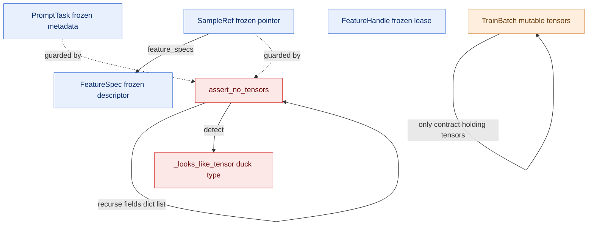

# DataFlow Contracts (PR 2/7 — `runtime/contracts.py`)

The shared, stdlib-only records every plane exchanges, plus the no-tensor guard.
The cross-plane picture lives in `ARCHITECTURE.md` (integration PR, 7/7).

## Responsibility

Defines the small, stdlib-only data records that SpecForge components exchange across the control plane and data plane, plus the runtime check that enforces the no-tensor boundary. It describes WHAT components exchange (prompt work units, sample pointers, feature specs, lease handles, materialized batches) without any backend implementation. The single load-bearing rule: control-plane records (PromptTask, SampleRef) carry metadata only — never tensors; tensors live in the data plane and surface only inside TrainBatch on the trainer side. Module imports only the standard library (torch is TYPE_CHECKING-only) so the control plane is reasoned about and unit-tested without torch or heavy model code.

## Internal mechanics

The contracts module is stdlib-only (torch is `TYPE_CHECKING`-only) so the control plane is reasoned about and unit-tested without torch. The control-plane records `PromptTask` and `SampleRef` are `@dataclass(frozen=True)` and carry metadata only: a `SampleRef` addresses one sample via `feature_store_uri` + `feature_keys` and embeds a `FeatureSpec` per named feature (shape/dtype/`target_repr`), but never a tensor. `FeatureHandle` is a frozen lease token (`sample_id`, `generation`, `lease_token`) whose `generation` lets a stale release become a safe no-op. `TrainBatch` is the only contract that carries tensors and is deliberately not frozen — it lives only on the trainer/data-plane side. `assert_no_tensors` is the load-bearing guard: it recurses through dataclass fields, dict values, and list/tuple/set/frozenset elements, threading a `_path` breadcrumb, and uses the duck-typed `_looks_like_tensor` (module root `torch`/`numpy`, or simultaneous `dtype`+`shape`+`device`) to raise `TypeError` at the first tensor — without importing torch or numpy.

## Records at a glance

| Record | Plane role | Carries tensors? |
|---|---|---|
| `PromptTask` | one unit of rollout work | no |
| `SampleRef` | pointer to one sample's features | no |
| `FeatureSpec` | shape/dtype descriptor of a feature | no |
| `FeatureHandle` | lease token from `FeatureStore.get` | no |
| `TrainBatch` | materialized, collated batch | **yes** (trainer side only) |

`assert_no_tensors` is run by the control plane on every record it accepts.
