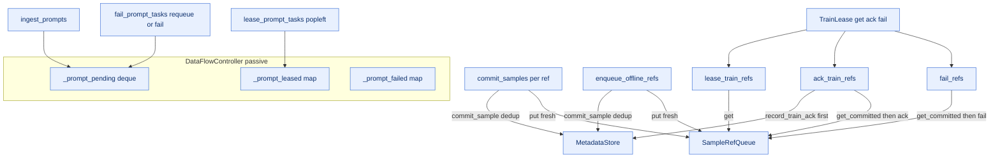

# Control Plane Design (PR 4/7 — `runtime/control_plane`)

This is the design note for the **control plane**, scoped to this plane.
The cross-plane picture (whole-system map, endpoint reference, autonomy) lives in
`ARCHITECTURE.md`, added in the integration PR (7/7); the shared records every
plane exchanges are in [`../contracts.py`](../contracts.py).

## Responsibility

Metadata-only scheduling, lifecycle, leasing, and recovery durability. Owns prompt and sample lifecycle, prompt/train leases, worker/trainer registration, dedup of committed samples, and the durable ack transaction. NEVER touches tensors (every record-accepting entrypoint runs assert_no_tensors) — all large tensors travel through the data plane. Online commit_samples and offline enqueue_offline_refs converge onto the same SampleRefQueue so the trainer path has no online/offline branch. Recovery-critical state sits behind a MetadataStore seam so a durable backend (SQLite/Redis/DB) is a swap, not a rewrite. (Note: weight publishing / weight-version registry is explicitly NOT yet implemented — flagged in source NOTE comments in both controller.py and metadata_store.py.)

## Internal mechanics

The `DataFlowController` is a passive metadata-only coordinator: it has no run loop, and every record-accepting entrypoint runs `assert_no_tensors`. It holds prompt lifecycle state — `_prompts`, a `_prompt_pending` deque, `_prompt_leased`, and `_prompt_failed` — under a single `_lock` that guards only the prompt/worker/trainer mutations and the `status()` snapshot; the sample-commit and train paths instead rely on the store's and queue's own internal locking. Durable/recovery state lives behind the `MetadataStore` seam: `commit_sample` dedups by `sample_id` (False = duplicate, dropped) and `record_train_ack` commits {acked sample_ids, global_step, optimizer_durable} as one atomic transaction. Online `commit_samples` and offline `enqueue_offline_refs` converge by enqueuing only fresh refs onto the same `SampleRefQueue`, so the trainer path has no online/offline branch. `ack_train_refs` deliberately orders `record_train_ack` BEFORE `sample_queue.ack` so a restart reconciles release state from the single committed marker. `TrainLease` is a stateless adapter that forwards `get`/`ack`/`fail` through the controller, so a cross-node trainer never holds a raw in-process queue and the durable ack is always recorded. Weight publishing / a weight-version registry is explicitly not yet implemented (flagged in source NOTEs).

## Endpoints

### What this plane calls into

| From | Endpoint | Plane |
|---|---|---|
| `DataFlowController` | `MetadataStore.commit_sample` | control |
| `DataFlowController` | `MetadataStore.record_train_ack` | control |
| `DataFlowController` | `MetadataStore.get_committed` | control |
| `DataFlowController` | `SampleRefQueue.put` | control |
| `DataFlowController` | `SampleRefQueue.get` | control |
| `DataFlowController` | `SampleRefQueue.ack` | control |
| `DataFlowController` | `SampleRefQueue.fail` | control |
| `TrainLease` | `DataFlowController.lease_train_refs` | control |
| `TrainLease` | `DataFlowController.ack_train_refs` | control |
| `TrainLease` | `DataFlowController.fail_refs` | control |

### Who calls into this plane

| Caller | Endpoint | Plane |
|---|---|---|
| `RolloutWorker` | `DataFlowController.register_rollout_worker` | control |
| `RolloutWorker` | `DataFlowController.lease_prompt_tasks` | control |
| `RolloutWorker` | `DataFlowController.commit_samples` | control |
| `RolloutWorker` | `DataFlowController.fail_prompt_tasks` | control |
| `OfflineManifestReader` | `DataFlowController.enqueue_offline_refs` | control |
| `FeatureDataLoader` | `TrainLease.get` | control |
| `TrainerController` | `DataFlowController.ack_train_refs` | control |
