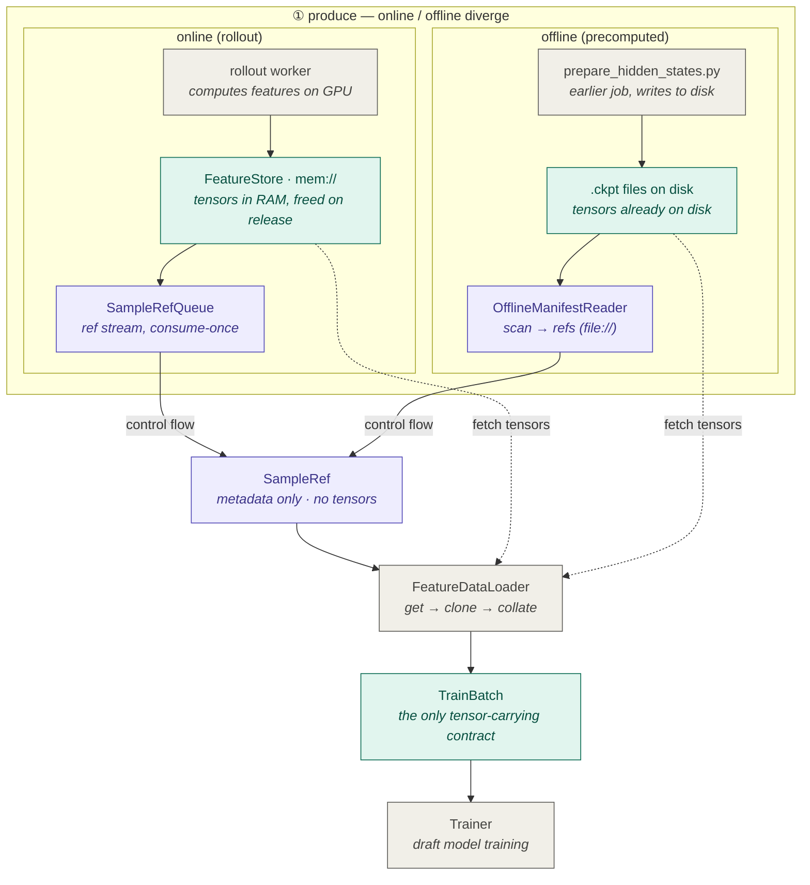

# Data Plane Design (PR 3/7 — `runtime/data_plane`)

This is the design note for the **data plane**: the large-tensor storage and
transfer boundary, plus the two metadata-only iteration sources that feed it and
the loader that turns references into training batches.

It is one slice of the larger DataFlow refactor. The end-to-end motivation and
staged plan live in `docs/dataflow_centered_scaleout_refactor_plan.md` on the
`refactor/specforge-redesign` branch; the shared records this layer exchanges are
defined in [`runtime/contracts.py`](../contracts.py).

## The one load-bearing invariant

There are **two planes**, and they never mix:

- **Control plane** moves only `SampleRef` — *metadata, never tensors*
  (`assert_no_tensors` enforces this structurally).
- **Data plane** (`FeatureStore`) is the *only* component that holds tensors.

Everything below is a consequence of keeping those two separate.

## Online vs offline: where they diverge, where they converge



Legend: teal = **data plane** (carries tensors) · purple = **control plane**
(metadata only) · gray = compute. Solid = control flow · dashed = tensor fetch.

Read it in three bands:

1. **Produce (diverge).** This is the *only* place the two modes differ — and
   they differ on both planes at once:
   - *Data plane:* online's `rollout_worker` computes tensors on the GPU and
     `put()`s them into `FeatureStore` as `mem://` (RAM). Offline's tensors were
     written to disk **earlier** by `prepare_hidden_states.py`; nobody re-writes
     them — the reader just points at the existing `.ckpt` files.
   - *Control plane:* online refs flow through `SampleRefQueue` (a consume-once
     stream); offline refs are produced by `OfflineManifestReader` scanning files
     (`file://`).

2. **Converge.** Both control-plane paths meet at `SampleRef` — a metadata-only
   contract. From here down, **no code branches on online vs offline.**

3. **Consume (shared).** `FeatureDataLoader → TrainBatch → Trainer` is one code
   path for both modes.

### The subtle part: control flow converges, tensors do not

Notice the dashed arrows **bypass** `SampleRef` and go straight into the loader.
Only the *control flow* (refs) actually merges. The *tensors* are fetched
separately by the loader via `store.get(ref)`, which **re-routes by URI**:

| ref URI    | source              | populates `_mem`? |
|------------|---------------------|-------------------|
| `mem://`   | `_mem` (RAM)        | yes (online only) |
| `file://`  | disk file (mmap)    | no                |

So the loader and trainer share one API and one code path, but the physical data
source stays split until the very last moment, behind `FeatureStore.get`.

## Components

All four live in this folder; each carries no knowledge of the model.

### `FeatureStore` / `LocalFeatureStore` — [`feature_store.py`](feature_store.py)

The data plane's storage and transfer boundary. `FeatureStore` is the abstract
contract; `LocalFeatureStore` is the only backend today (shared-memory and
Mooncake/RDMA backends slot in behind the same API later).

`LocalFeatureStore` serves both ref flavours transparently:

- `mem://<store_id>/<sample_id>` — produced by `put()` (online rollout), held in
  RAM on the hot path, with an opt-in disk/mmap `dump_dir` that doubles as the
  capture/replay tap.
- `file://<abs_path>` — produced by `OfflineManifestReader`; `get()` lazily loads
  the named keys out of the existing file. No tensor copy, no `_mem` residency.

Why RAM for the online hot path (not disk): online samples are computed fresh,
consumed once, and require freshness — there is no reuse to amortize a disk
round-trip, and disk bandwidth would bottleneck rollout. Offline samples are the
opposite (computed once, reused every epoch), which is exactly why offline lives
on disk.

### `SampleRefQueue` — [`sample_ref_queue.py`](sample_ref_queue.py)

A **metadata-only** queue with lease / ack / fail semantics (carries no
tensors). In-process today, but the lease contract is present so a durable queue
(visibility timeout, replay) can be swapped in without touching callers.
`put` is idempotent on `sample_id` (at-least-once delivery); `fail(retryable=…)`
either requeues or drops.

### `OfflineManifestReader` — [`offline_reader.py`](offline_reader.py)

Walks a directory of precomputed `.ckpt` files and emits one metadata-only
`SampleRef` per file, referencing each file in place via a `file://` URI. It is
the offline **ref producer** — it never `put()`s tensors. (Its online counterpart
is `rollout_worker`, not the queue.)

### `FeatureDataLoader` — [`feature_dataloader.py`](feature_dataloader.py)

The bridge from `SampleRef` to `TrainBatch`, and the one place the online/offline
difference is erased. Two iteration modes:

- `queue` — online stream, consume-once, owns ack/fail of the queue.
- `refs` — offline fixed set, re-iterable across epochs.

For each ref it materializes (`store.get` → clone-on-fetch → `store.release`),
applies an **injected** `per_sample_transform`, validates batch homogeneity,
collates via an **injected** `collate_fn`, and emits a `TrainBatch`. Because
transform and collate are injected, the loader carries no model knowledge and is
unit-testable on CPU.

What is explicitly **not** the loader's job: model semantics (injected), physical
tensor free (the store's job — see below), and how samples are produced.

## Lifecycle and memory semantics

The store has five lifetime ops:

| op          | who calls it                          | effect on `_mem`            |
|-------------|---------------------------------------|-----------------------------|
| `put`       | `rollout_worker` (online only)        | adds the sample             |
| `get`       | `FeatureDataLoader`                   | none (hands out a lease)    |
| `release`   | `FeatureDataLoader` after fetch       | frees on the last lease     |
| `abort`     | `rollout_worker` / terminal drop      | evicts (frees the sample)   |
| `gc`        | controller/orchestrator on a timer    | force-frees abandoned bytes |

### Consume-once free (the design point worth remembering)

`mem://` samples are **consume-once**. The store owns the tensors, and physical
free is the *store's* responsibility — the consumer never needs to know the
backend's memory policy. `release()` therefore frees the sample's tensors once
the **last lease on the current generation** drops (reference-counted). `file://`
samples never enter `_mem`, so release is a harmless no-op for them and offline
ref sets stay re-iterable across epochs.

Generation is a **global monotonic counter**: a re-`put` of the same `sample_id`
always gets a strictly higher generation, so a stale handle released after the
re-put is a safe no-op and can never alias freshly stored data. This is what lets
`release()` drop the `_generation` entry too, bounding metadata growth.

> **History / rationale.** An earlier version made `release()` free only the
> *lease*, leaving tensors in `_mem` until `abort()`. But on the online success
> path nothing calls `abort()` (it is only reached on a failed `put`), so a
> `put → get → release` loop over unique `sample_id`s grew `_mem` without bound —
> an OOM on long online runs. Offline was unaffected (it uses `file://`, never
> `_mem`). The fix moves physical free into `release()` as above; see the
> `test_release_*` and `test_online_put_get_release_loop_is_bounded` tests.

### Backpressure guard

`LocalFeatureStore(max_resident_bytes=…)` (opt-in, default unbounded) makes
`put()` raise a descriptive `MemoryError` once residency would exceed the budget
— a defined failure instead of a silent OOM when the consumer falls behind.
Residency is observable via `health()`. The *controller* reads `health()` and
pauses prompt leasing at a high watermark **before** this trips (see
`control_plane/backpressure.py`); the cap is the backstop, not the primary
mechanism.

### GC and max-hold (M5)

Backpressure only pauses *new* rollout — it cannot free bytes a slow trainer left
*leased-then-stranded* or *committed-but-never-leased*. The store therefore needs
an independent reclamation path. `gc()` (idempotent, safe on a timer) does two
things:

1. **Max-hold force-free.** `max_hold_age_s` (distinct from the *queue* lease
   timeout) makes a sample eligible for force-free once it is older than the
   bound **and** no active lease references it. A still-leased old sample is
   spared — force-freeing it would be a use-after-free for the holder. This is
   the "trainer lags for hours" backstop.
2. **Release-pending reconciliation.** A backend whose physical free is
   async/fallible (Mooncake later) parks the sample release-pending on
   `release()`; `gc()` retries within a bounded window (`max_release_attempts`)
   then force-frees, so a stuck cleanup never pins bytes forever. The local
   backend frees synchronously, so this path is exercised by a fault-injecting
   subclass in the tests.

`abort()` drops a sample immediately (failed `put`, terminal-sample drop); it
frees the tensors and all per-sample bookkeeping, which is what the leak gate
relies on.

**Deadlock-avoidance rule.** In the local-colocated profile the *primary* bound
is rollout-pause backpressure + trainer-priority dispatch draining the backlog;
`gc()` max-hold is the *backstop* that evicts the oldest abandoned (unleased)
refs. A force-freed ref's later `get()` raises `KeyError`, which the loader turns
into a sample failure the controller retries or marks terminal — the failure
paths compose.

## Tests

CPU-only, in [`tests/test_runtime/`](../../../tests/test_runtime):

- `test_feature_store.py` — atomic put, get/handle, idempotent + stale-safe
  release, **consume-once free**, refcounted multi-lease, **bounded online
  loop**, `max_resident_bytes`, abort, disk dump, `file://` mode. The
  `TestFeatureStoreGC` class adds the M5 reclamation surface: **leak gate**
  (`test_abort_returns_bytes_to_baseline`), **max-hold force-free** (sparing
  leased samples), and **release-pending reconciliation** via `gc()`.
- `test_sample_ref_queue.py` — lease / ack / fail / depth, idempotent put.
- `test_feature_dataloader.py` — queue and refs modes, drop_last, batch
  homogeneity validation, offline re-iteration across epochs.

```bash
# heavy model imports are stubbed on CPU; runs without a GPU or model download
python -m unittest discover -s tests/test_runtime
```
