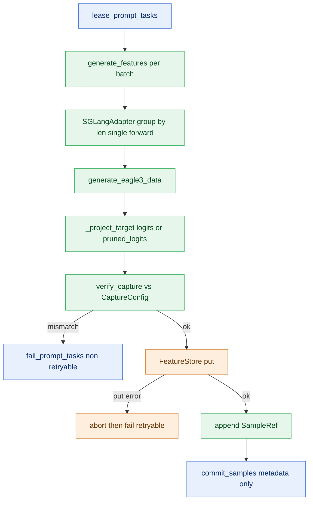

# Inference Plane Design (PR 5/7 — `runtime/inference`)

This is the design note for the **inference**, scoped to this plane.
The cross-plane picture (whole-system map, endpoint reference, autonomy) lives in
`ARCHITECTURE.md`, added in the integration PR (7/7); the shared records every
plane exchanges are in [`../contracts.py`](../contracts.py).

## Responsibility

The rollout/inference plane turns leased PromptTasks into per-sample feature tensors and commits only their typed SampleRef metadata to the controller — it never hands a tensor to the controller. It owns the clean boundary to the target engine (Eagle3TargetModel via generate_eagle3_data), the only place target→draft projection/pruning happens, and the loud pre-write validation (verify_capture against a typed CaptureConfig) that converts layer/name/width/target-dim mismatches into immediate, localized errors at the extraction boundary instead of downstream trainer bugs.

## Internal mechanics

The rollout plane turns leased `PromptTask`s into per-sample feature tensors and commits only their typed `SampleRef` metadata — it never hands a tensor to the controller. `RolloutWorker.run_once` is the core loop: lease up to `max_tasks`, call `feature_source.generate_features(tasks, capture=...)` once for the whole batch, enforce a strict `len(feats)==len(tasks)` contract, then per sample pop the out-of-band `__aux_layer_ids__`, run `verify_capture`, and on success `FeatureStore.put` (tensors go straight to the data plane). Every leased task ends in exactly one terminal controller action — `commit_samples` on success or `fail_prompt_tasks` on generate failure / wrong count / capture mismatch / put failure — with `sample_id = f"{run_id}:{task.task_id}"` deterministic and a put exception triggering `abort`. `CaptureConfig` is a frozen, strategy-derived contract carrying `feature_names`, `aux_hidden_state_layer_ids`, `target_repr`, and the derived `expected_aux_width` / `expected_target_dim()`. `verify_capture` is the loud pre-`put` validator: it checks name presence, aux-layer-id equality, aux last-dim width, and target last-dim, gating `pruned_logits` on a non-None `vocab_map_version`, raising `CaptureMismatchError` at the boundary. `SGLangAdapter` is the only place target to draft projection happens (`_project_target`: passthrough for `logits`, `t2d`-indexing for `pruned_logits`), batching equal-length tasks into one padding-free `generate_eagle3_data` forward and slicing rows back into original task order.

## Endpoints

### What this plane calls into

| From | Endpoint | Plane |
|---|---|---|
| `RolloutWorker` | `DataFlowController.register_rollout_worker` | control |
| `RolloutWorker` | `DataFlowController.lease_prompt_tasks` | control |
| `RolloutWorker` | `SGLangAdapter.generate_features` | compute |
| `SGLangAdapter` | `Eagle3TargetModel.generate_eagle3_data` | compute |
| `RolloutWorker` | `FeatureStore.put` | data |
| `RolloutWorker` | `FeatureStore.abort` | data |
| `RolloutWorker` | `DataFlowController.commit_samples` | control |
| `RolloutWorker` | `DataFlowController.fail_prompt_tasks` | control |
