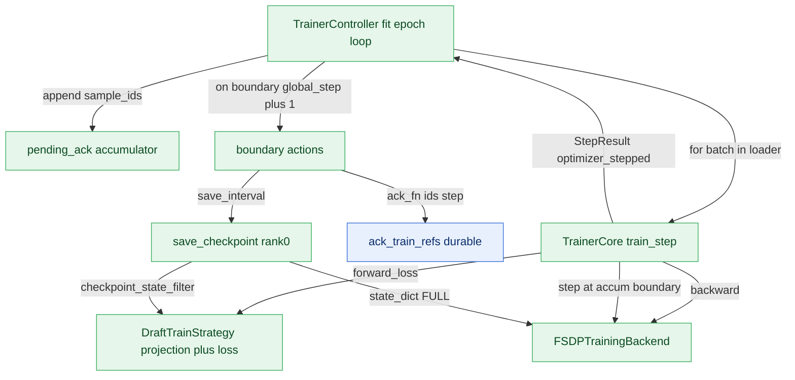

# Training Plane Design (PR 6/7 — `runtime/training`)

This is the design note for the **training**, scoped to this plane.
The cross-plane picture (whole-system map, endpoint reference, autonomy) lives in
`ARCHITECTURE.md`, added in the integration PR (7/7); the shared records every
plane exchanges are in [`../contracts.py`](../contracts.py).

## Responsibility

Owns the trainer-boundary split that turns a normalized, tensor-carrying TrainBatch into optimizer steps and checkpoints. Layered as: TrainerController (lifecycle: fit/evaluate/save_checkpoint, epoch loop, optimizer-step counting, durable ack at grad-accum boundary) -> TrainerCore (exactly one branch-free train/eval step + grad-accumulation/optimizer boundary) -> DraftTrainStrategy (per-draft-model required-feature validation, forward/loss, target projection ownership, checkpoint key filtering) and TrainingBackend (model wrap / backward / optimizer step + distributed grad-norm reduction / state_dict). The plane is the ONLY tensor-carrying side besides the data plane (consumes TrainBatch.tensors). Strategy differs per draft model (EAGLE3 TTT vs DFlash block-parallel); controller/core/backend/checkpoint are shared unchanged. Submodules import SpecForge model code so they are imported explicitly by training entry points, not at specforge.runtime package load, keeping the control/data plane importable without a GPU. Note: the module docstrings still reference a not-yet-implemented weight-publication / serving accept-length gate as future work; save_checkpoint only persists training state and returns a resume-target Checkpoint.

## Internal mechanics

The training plane is the only tensor-carrying side besides the data plane; it consumes `TrainBatch.tensors`. `TrainerCore` executes exactly one branch-free step: `train_step` calls `strategy.forward_loss`, divides the loss by `accumulation_steps`, calls `backend.backward`, increments `self._micro`, and only at the boundary (`self._micro % self.accumulation_steps == 0`) calls `backend.step()` for the grad-norm — `optimizer_stepped` in the returned `StepResult` is the single authoritative boundary signal, and `_scalar` ensures no live tensor leaks out. `TrainerController` owns the lifecycle: `global_step` counts optimizer steps only, and it maintains a `pending_ack` accumulator of `batch.sample_ids` that is flushed via `ack_fn(pending_ack, global_step)` as one durable transaction exactly at each boundary, then cleared. The model-specific work lives in `DraftTrainStrategy`: `validate_batch` fail-fasts on missing `required_features`, and the strategy — not the core — owns the target projection (`Eagle3TrainStrategy._prepare_target` re-runs the frozen `TargetHead` for `target_repr=='hidden_state'`, computes the decayed per-position TTT loss) and `checkpoint_state_filter` (keep `draft_model.*`, strip prefix, drop `embed`). `FSDPTrainingBackend` carries the parallel layout via `ParallelConfig.from_distributed` (handles snapshotted, never re-derived), FSDP-wraps with `use_orig_params=True`/bf16, performs the optimizer step plus a distributed L2 grad-norm all-reduce, and produces a `FULL_STATE_DICT`. `save_checkpoint` writes training state on rank0 only and returns a resume-target `Checkpoint` — not a published weight version.

## Endpoints

### What this plane calls into

| From | Endpoint | Plane |
|---|---|---|
| `TrainerController` | `FeatureDataLoader.__iter__` | compute |
| `TrainerController` | `TrainerCore.train_step` | compute |
| `TrainerController` | `TrainerCore.eval_step` | compute |
| `TrainerController` | `DataFlowController.ack_train_refs` | control |
| `TrainerCore` | `Eagle3TrainStrategy.forward_loss` | compute |
| `TrainerCore` | `FSDPTrainingBackend.backward` | compute |
| `TrainerCore` | `FSDPTrainingBackend.step` | compute |
